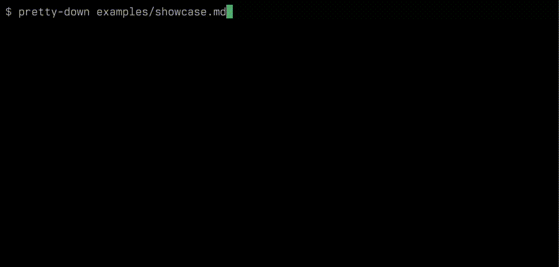

# pretty-down

> **Fair warning:** This was vibe-coded for my own personal use. It works for me,
> but your mileage may vary.
>
> I only test on linux as that is my current environment. If anyone is aware of similar
> projects/prior art, please let me know so I can link them here. The goal of this was to have
> in-terminal pretty rendering of markdown files which goes beyond syntax highlighting and is closer
> to what you would get rendering with a browser or with e.g. vscode's markdown preview.



A CLI tool that renders markdown in the terminal using [Sixel](https://en.wikipedia.org/wiki/Sixel)
graphics. Headings are rendered as actual rasterized text with larger fonts, and
images are displayed inline — all without leaving your terminal.

## What it does

- **Headings (h1-h6)** — Rendered as Sixel images with scaled font sizes,
  with half-block Unicode previews while scrolling
- **Bold, italic, strikethrough, underline** — ANSI terminal styling
- **Links** — Clickable via [OSC 8](https://gist.github.com/egmontkob/eb114294efbcd5adb1944c9f3cb5feda)
  hyperlinks (in supported terminals)
- **Images** — Loaded from local paths or URLs, displayed inline as Sixel
  with half-block previews while loading or partially visible
- **Animated GIFs** — Decoded and animated in the pager with per-frame timing
- **Video** — MP4, WebM, MKV, AVI, MOV playback via FFmpeg (requires
  FFmpeg libraries installed)
- **Syntax highlighting** — Code blocks with language tags are highlighted
  via [syntect](https://crates.io/crates/syntect) with true-color output
- **Horizontally scrollable code blocks** — Code doesn't wrap; scroll
  sideways with the mouse
- **Tables** — Rendered with Unicode box-drawing borders, with half-block
  image previews inside cells
- **Blockquotes** — Styled with `│` prefix on every line, supports nesting
- **Lists** — Ordered, unordered, nested
- **Horizontal rules**
- **`<details>`/`<summary>`** — Collapsible sections, click or press Enter
  to toggle
- **HTML elements** — `<b>`, `<i>`, `<u>`, `<mark>`, `<kbd>`, `<del>`,
  `<span>`, `<div>` with inline CSS styles (`color`, `background-color`,
  `font-weight`, `font-style`, `text-decoration`)
- **Color themes** — Customizable via JSON theme files
- **File watching** — Auto-reload on file changes with `-w`

## Requirements

- A Sixel-capable terminal (e.g. WezTerm, foot, mlterm, xterm with `-ti vt340`)
- Rust 2024 edition (1.85+)
- **FFmpeg development libraries** (for video support):
  ```sh
  # Debian/Ubuntu
  sudo apt install libavutil-dev libavformat-dev libavcodec-dev libswscale-dev libavfilter-dev libavdevice-dev pkg-config
  # Fedora
  sudo dnf install ffmpeg-devel
  # macOS
  brew install ffmpeg pkg-config
  ```

## Usage

```
pretty-down [OPTIONS] [FILE]
```

Reads from stdin if no file is given.

```sh
# Render a file
pretty-down examples/showcase.md

# Watch for changes
pretty-down -w examples/showcase.md

# Use a custom font and theme
pretty-down --font /path/to/font.ttf --theme examples/themes/dracula.json doc.md

# Use a different syntax highlighting theme
pretty-down --syntax-theme "Solarized (dark)" doc.md

# Pipe from stdin (no pager)
cat notes.md | pretty-down
```

### Pager keybindings

| Key | Action |
|-----|--------|
| `j` / `Down` | Scroll down |
| `k` / `Up` | Scroll up |
| `d` / `PageDown` | Half page down |
| `u` / `PageUp` | Half page up |
| `Space` | Page down |
| `g` / `Home` | Top |
| `G` / `End` | Bottom |
| `Enter` | Toggle `<details>` block |
| `r` | Reload |
| `q` / `Esc` | Quit |
| Mouse scroll | Vertical scroll (3 lines) |
| Mouse h-scroll | Horizontal scroll on code blocks |
| Mouse click | Toggle `<details>` summary |

## Building

```sh
cargo build --release
```

## Example

A comprehensive showcase of all features is included:

```sh
cargo run --release -- examples/showcase.md
```

See [`examples/showcase.md`](examples/showcase.md) for the full feature
demonstration including syntax highlighting, images, GIFs, tables,
collapsible sections, and styled HTML.

## Dependencies

- [pulldown-cmark](https://crates.io/crates/pulldown-cmark) — Markdown parsing
- [a-sixel](https://crates.io/crates/a-sixel) — Sixel encoding
- [syntect](https://crates.io/crates/syntect) — Syntax highlighting
- [rustybuzz](https://crates.io/crates/rustybuzz) — Text shaping
- [raqote](https://crates.io/crates/raqote) — 2D rasterization
- [crossterm](https://crates.io/crates/crossterm) — Terminal interaction
- [notify](https://crates.io/crates/notify) — File watching
- [quick-xml](https://crates.io/crates/quick-xml) — HTML tag parsing
- [image](https://crates.io/crates/image) — Image loading and GIF decoding
- [ffmpeg-next](https://crates.io/crates/ffmpeg-next) — Video decoding
- [reqwest](https://crates.io/crates/reqwest) — HTTP image fetching

## License

This software is released into the public domain under the [Unlicense](UNLICENSE).

The Fairfax font is included under the [SIL Open Font License](fonts/FairfaxOFL.txt).
